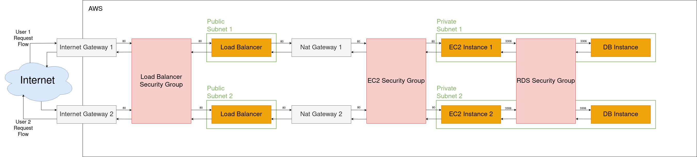

# Projeto Final de Computação em Nuvem
[ENGLISH VERSION](README_EN.md)

## Visão Geral do Projeto
Este projeto automatiza o provisionamento de infraestrutura de nuvem pública escalável e resiliente na AWS usando o Terraform. Ele foi projetado para implantar uma API RESTful simples baseada em Python, suportada por uma infraestrutura de backend robusta que inclui um Application Load Balancer (ALB), instâncias EC2 com escalonamento automático e um banco de dados RDS MySQL.

## Repositório Auxiliares
O código da API RESTful feita em Python utilizando Flask está disponível aqui: [Código da API RESTful feita em Python utilizando Flask](https://github.com/viniciusmm7/generic-flask-rest-api)

## Manual de uso

### Criando a infraestrutura na AWS
Primeiramente é esperado que o usuário já possua uma conta na AWS e obtenha o `access_key_id` e `secret_access_key` e então:

```shell
export AWS_ACCESS_KEY_ID=<ACCESS-KEY-DO-USUARIO>
export AWS_SECRET_ACCESS_KEY=<SECRET-ACCESS-KEY-DO-USUARIO>
export AWS_DEFAULT_REGION=<REGIAO-PADRAO-DO-USUARIO>
```

Para mais detalhes, consulte a [documentação oficial da AWS](https://docs.aws.amazon.com/cli/latest/userguide/cli-configure-envvars.html)

É necessário também que o usuário tenha um **S3 Bucket** com o nome `terraform-bucket-viniciusmm7`, a criação deve ser manual na AWS. Ele é necessário para armazenar informações do backend do Terraform.

Agora basta executar:

```shell
cd final-project-cloud-computing
terraform init
terraform apply -auto-approve
```

> [!TIP]
> Esta execução irá demorar vários minutos, podendo levar em torno de 20 minutos para terminar, vá tomar um café ou passear com o seu porquinho-da-índia.

Ao terminar, basta copiar o DNS do **Load Balancer** disponível no terminal e testar a conexão direto no navegador, caso não esteja disponível, basta executar o comando abaixo e copiar o valor de `dns_name`:

```shell
terraform state show module.ec2.aws_lb.load_balancer
```

A resposta esperada é `{message: "Connected successfully!"}`

### Destruindo a infraestrutura na AWS
> [!WARNING]
> Esta etapa é demorada assim como a criação da infraestrutura, recomenda-se atenção antes de executar.

```shell
terraform destroy -auto-approve
```

## Infraestrutura

### Escolha da região
A região escolhida para este projeto foi a `us-east-1` (Norte da Virgínia). Apesar de ser a região mais famosa e por conta disso ter mais interrupções, iremos escolhe-la por ser barata, possuir uma boa latência para as necessidades do projeto e possuir uma grande abrangência de serviços disponíveis, que podem ser úteis para uma escala maior deste projeto.

### Rede
A rede possui uma **VPC** (Virtual Private Cloud) customizado para o CIDR `10.0.0.0/16` e quatro **subredes**, sendo duas públicas (`10.0.1.0/24`, `10.0.2.0/25`) e duas privadas (`10.0.7.0/24`, `10.0.8.0/24`) disponíveis em duas regiões disponíveis para uma maior disponibilidade (HA), desta forma podem ser adicionadas mais quatro subredes públicas e quatro privadas no futuro, caso haja necessidade.

### Instâncias EC2 e Autoscaling
As instâncias são provisionadas automaticamente através de um **Launch Template**, utilizando um **Autoscaling Group** para gerenciar o mínimo de 2 instâncias disponíveis 24/7 e o máximo de 5. Mais instâncias são provisionadas conforme o uso para cada instância disponível aumenta, tendo uma regra para quando a média de CPU atingir 70% ou ALB Request Count Per Target atingir 200. As instâncias adicionais vão sendo desligadas conforme o uso das instâncias reduz, tendo uma regra para quando a média de CPU atingir 10%.

### Balanceador de Carga
Necessário para que seja distribuído o tráfego proporcionalmente através das instâncias disponíveis, levando em conta a eficiência e a tolerância a falhas.

### RDS com banco MySQL
Instância de banco de dados MySQL configurada com **Multi-AZ** para alta disponibilidade (HA), com configurações de backup a cada 7 dias e janela de manutenção programada para domingo 04h00-05h00 UTC. As credenciais sensíveis do banco de dados são manipuladas pelo **Secrets Manager**.

### Grupos de Segurança
Três grupos de segurança foram definidos, um para o **Load Balancer**, um para as instâncias EC2 e um para o RDS. Dessa forma o RDS só aceita requisições feitas na porta 3306 (padrão do MySQL) enquanto os outros apenas aceitam entradas na porta 80 (HTTP).

## Análise de Custo
O custo estimado utilizando a calculadora oficial da AWS foi: US$ 134,83/mês. Mais detalhes [aqui](My%20Estimate%20-%20Calculadora%20de%20Preços%20da%20AWS.pdf).

## Diagrama da Infraestrutura
